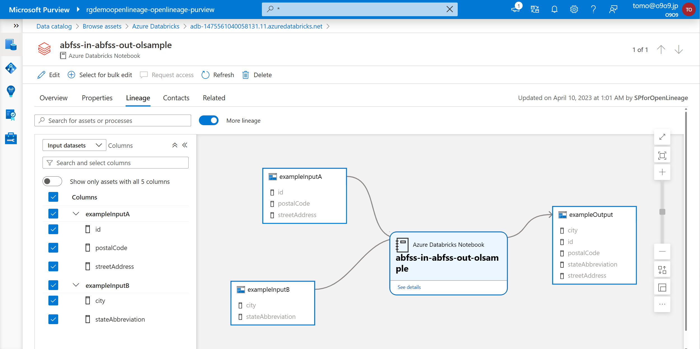
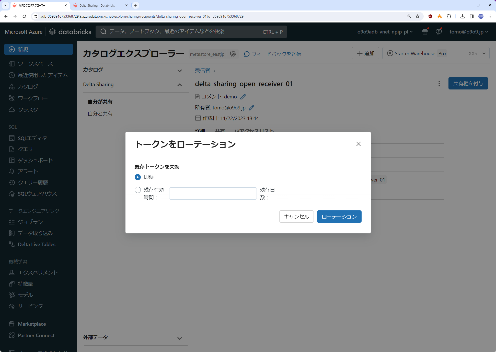

Paste Image を利用。
Ctrl + Alt + v でクリップボードの画像をペースト。
https://raw.githubusercontent.com/gho9o9/imagerepo/main/<カテゴリ>/images/*.png


<p  style="position:relative;width: 1000px;height: 450px;overflow: hidden;">
  
</br>
  
</p>
</div>


    



  
  
  
  
  
  
  

# Delta Sharing
## TL;DR
- 組織内外にセキュアにデータ共有する機能（インプレース ＆ R/O 共有）。  
- Databricks間共有とオープン共有があり、共有先の環境を限定しない。  
  
  
  
  
  


## ハンズオン

### 1. 事前設定
#### 1-1. [メタストアで Delta Sharing を有効化する](https://learn.microsoft.com/ja-jp/azure/databricks/data-sharing/set-up)  
[アカウントコンソール]->[データ] から対象のメタストアを選択し [Delta Sharing] のチェックボックスをクリック
  
[トークンの既定有効期限を設定し有効化](https://learn.microsoft.com/ja-jp/azure/databricks/data-sharing/create-recipient#--manage-recipient-tokens-open-sharing)  
  
- トークンはオープン共有の受信側が共有データにアクセスする際に利用  
- Databricks 間共有にはトークンは利用されない（＝共有設定が存在する限り無期限）  
- 既定の有効期限はいつでも変更可能（すでに発行済みのトークンには反映されない）
- 発行済みトークンの有効期限は即時失効や前倒し可能（後ろ倒しは不可）
- 失効した場合はあらためてアクティベーションリンク（後述）の共有が必要  

  

#### 1-2. [監査ログ有効化(オプション)](https://learn.microsoft.com/ja-jp/azure/databricks/data-sharing/audit-logging-provider)

##### [一覧確認](https://learn.microsoft.com/ja-jp/azure/databricks/administration-guide/system-tables/#list-available-system-schemas)
```bash
curl -v -X GET -H "Authorization: Bearer <PAT Token>" "https://adb-<xxx>.azuredatabricks.net/api/2.0/unity-catalog/metastores/<metastore-id>/systemschemas"
```  
  

##### [有効化](https://learn.microsoft.com/ja-jp/azure/databricks/administration-guide/system-tables/#enable-a-system-schema)
```bash
curl -v -X PUT -H "Authorization: Bearer <PAT Token>" "https://adb-<xxx>.azuredatabricks.net/api/2.0/unity-catalog/metastores/<metastore-id>/systemschemas/<SCHEMA_NAME>"
```
  
  

### 2. [Databricks 間共有](https://learn.microsoft.com/ja-jp/azure/databricks/data-sharing/share-data-databricks#databricks-to-databricks-delta-sharing-workflow)

#### 2-1. [送信側による共有設定](https://learn.microsoft.com/ja-jp/azure/databricks/data-sharing/share-data-databricks#databricks-to-databricks-delta-sharing-workflow)

##### 2-1-1. [共有の作成](https://learn.microsoft.com/ja-jp/azure/databricks/data-sharing/create-share)
[カタログエクスプローラー]->[Delta Sharing]->[自分が共有]->[データの共有]  
  
[アセットを追加]  
  
  
※.オプションでタイムトラベルやCDFアクセスを許可可能  
  
  

##### 2-1-2. [受信者の共有識別子の取得](https://learn.microsoft.com/ja-jp/azure/databricks/data-sharing/create-recipient#request-uuid)  
[カタログエクスプローラー]->[Delta Sharing]->[自分と共有]  
※. 受信者の Databricks アカウント側の操作
  

##### 2-1-3. [受信者の作成](https://learn.microsoft.com/ja-jp/azure/databricks/data-sharing/create-recipient#create-recipient-db-to-db)
[カタログエクスプローラー]->[Delta Sharing]->[自分が共有]->[データの共有]->[新たな受信者] で受信者の共有識別子を入力  
  
  

##### 2-1-4. [受信者へのアクセス許可](https://learn.microsoft.com/ja-jp/azure/databricks/data-sharing/grant-access)  
共有対象を選択  
  
  

#### 2-2. [受信側での共有の利用](https://learn.microsoft.com/ja-jp/azure/databricks/data-sharing/read-data-databricks)  
[カタログエクスプローラー]->[Delta Sharing]->[自分と共有]  
  
[カタログを作成]  
  
カタログ名を設定  
  
  
※ ストレージへのアクセス権が無い場合はNG（組織外だと、これは使いにくい。。。）
  

### 3. [オープン共有](https://learn.microsoft.com/ja-jp/azure/databricks/data-sharing/share-data-open)  

#### 3-1. [送信側による共有設定](https://learn.microsoft.com/ja-jp/azure/databricks/data-sharing/share-data-open#delta-sharing-open-sharing-workflow)

##### 3-1-1. [共有の作成](https://learn.microsoft.com/ja-jp/azure/databricks/data-sharing/create-share)
[カタログエクスプローラー]->[Delta Sharing]->[自分が共有]->[データの共有]  
  
[アセットを追加]  
  
  
※.オプションでタイムトラベルやCDFアクセスを許可可能  
  
  

##### 3-1-2. [受信者の作成](https://learn.microsoft.com/ja-jp/azure/databricks/data-sharing/create-recipient#create-recipient-db-to-db)
[カタログエクスプローラー]->[Delta Sharing]->[自分が共有]->[データの共有]->[新たな受信者]  
※.オープン共有の場合は受信者の共有識別子の入力は不要
  
アクティベーションリンクを受信者に共有  
  
  

##### 3-1-3. [受信者へのアクセス許可](https://learn.microsoft.com/ja-jp/azure/databricks/data-sharing/grant-access)  
共有対象を選択  
  
  

#### 3-2. [受信側での共有の利用](https://learn.microsoft.com/ja-jp/azure/databricks/data-sharing/read-data-open)  

##### 3-2-1. [アクティベーションリンクを受信者から入手](https://learn.microsoft.com/ja-jp/azure/databricks/data-sharing/create-recipient#get-activation-link)  
※. 送信者の Databricks アカウント側の操作
  

##### 3-2-2. [資格情報ファイルの入手](https://learn.microsoft.com/ja-jp/azure/databricks/data-sharing/recipient#get-access-open)  
アクティベーションリンクにアクセスし資格情報ファイルをダウンロードする
  
  
  

##### 3-2-3. 例：Power BI から共有にアクセス  
資格情報ファイルからエンドポイントとベアラートークンをメモ  
  
[データを取得]から[Delta Sharing]を選択 
  
メモしたエンドポイントとベアラートークンを入力  
  
  
ここから先は他のデータソースと同様の操作
  
  
※. [Delta Sharing Ecosystem](https://delta.io/sharing/)
  

#### 3-3. [補足：トークンの管理](https://learn.microsoft.com/ja-jp/azure/databricks/data-sharing/create-recipient#--manage-recipient-tokens-open-sharing)  
- トークンはオープン共有の受信側が共有データにアクセスする際に利用  
- Databricks 間共有にはトークンは利用されない（＝共有設定が存在する限り無期限）  
- 既定の有効期限はいつでも変更可能（すでに構成済みの共有には反映されない＝失効後にトークンを再発行しても構成時の有効期限が利用される）
- 発行済みトークンの有効期限は即時失効や前倒し可能（後ろ倒しは不可）
- 失効した場合はあらためてアクティベーションリンク（後述）の共有が必要  

発行済みトークンの有効期限は即時失効や前倒し可能（後ろ倒しは不可）  
  
  
トークンの有効期限が失効すると Status が 保留中 となりアクセスは拒否される。
  
共有を再開する場合はアクティベーションリンクを再共有する。
  
資格情報ファイルをダウンロードされると Status が 有効化済み となる。
  

# DBSQL


# Workflows
  
  
  
  
  
  
  
  

# UC
  
  
  
  
  
  
  
  
  
  
  
  
  
  
  
  
  
  

  
  
  
  
  
  
  

  
  
  
  
  
  
  
  
  
  
  
data / __unitystorage / catalogs / e94e40e2-b480-4e6d-97da-367d14b6ae79 / tables / 6a2f9cef-e362-4891-b442-8c861d6bcc50  
  
  
  
  
  
unitycatalog / metastore / b0aa6069-2eb1-4c2e-b0d1-22e19233b689 / tables / 35e08fd8-19c6-47eb-b62f-e57f4a915896  

# Storage


# Optimize  
  
  
  


# Purview UC
  
  
  
  
  
  
  
  
  

# Purview Lineage
  
  
  

# w/ADF
① コピーアクティビティ  
コピーアクティビティは Hive Metastore のみサポート
  
  
既存テーブルへのSyncのみ（テーブル新規作成は不可）

パイプライン実行後にDeltaTableへの出力を確認  
  

② データフロー  
データフローはストレージへのDelta出力をサポート

  
パイプライン実行後に UC へのカタログ登録とDeltaTableとしての出力を確認  
  

＜参考＞
- https://learn.microsoft.com/ja-jp/azure/data-factory/connector-azure-databricks-delta-lake?tabs=data-factory
- https://learn.microsoft.com/ja-jp/azure/data-factory/format-delta  


# Security
  
  
  
  
  
  
  
  
  
  
  
  
  
  
  
  