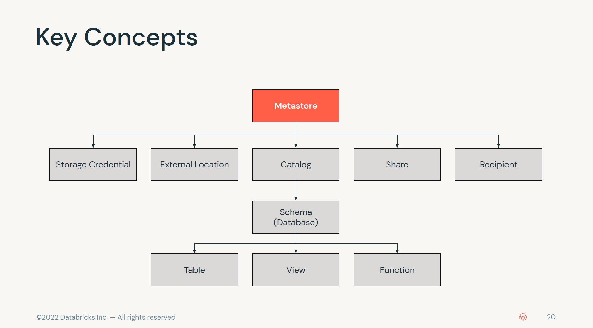

Paste Image を利用。
Ctrl + Alt + v でクリップボードの画像をペースト。
https://raw.githubusercontent.com/gho9o9/imagerepo/main/<カテゴリ>/images/*.png

    

  
  
  
  
  
  

# Workflows
  
  
  
  
  
  
  
  

# UC
  
  
  
  
  
  
  
  
  
  
  
  
  
  
  
  
  
  

  
  
  
  
  
  
  

  
  
  
  
  
  
  
  
  
  
  
data / __unitystorage / catalogs / e94e40e2-b480-4e6d-97da-367d14b6ae79 / tables / 6a2f9cef-e362-4891-b442-8c861d6bcc50  
  
  
  
  
  
unitycatalog / metastore / b0aa6069-2eb1-4c2e-b0d1-22e19233b689 / tables / 35e08fd8-19c6-47eb-b62f-e57f4a915896  

# Storage
