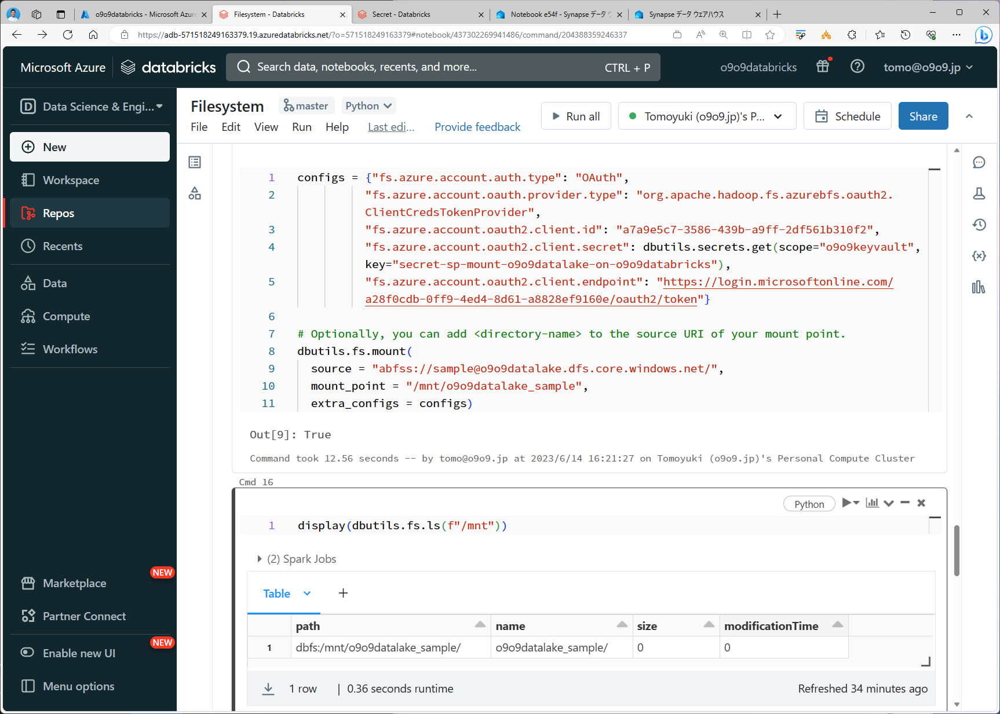
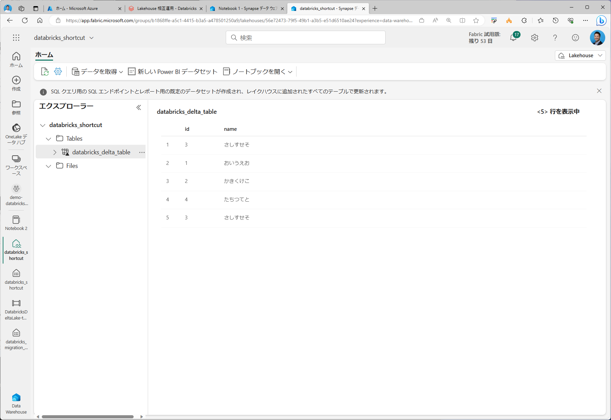
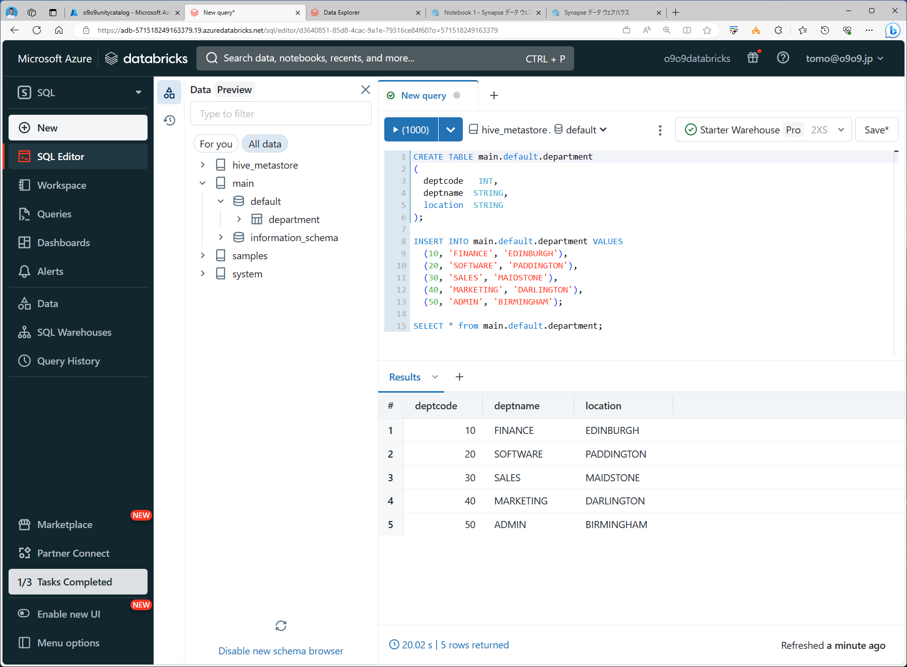
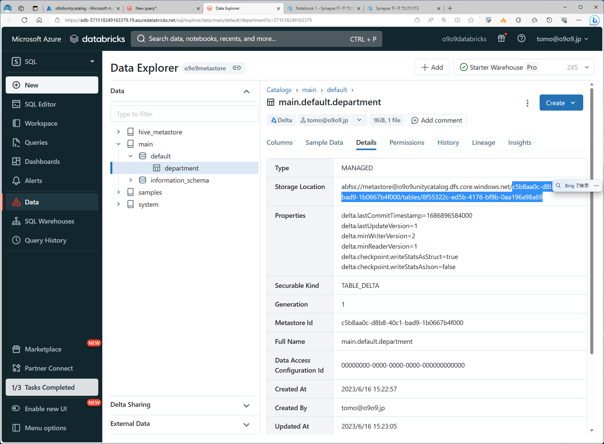
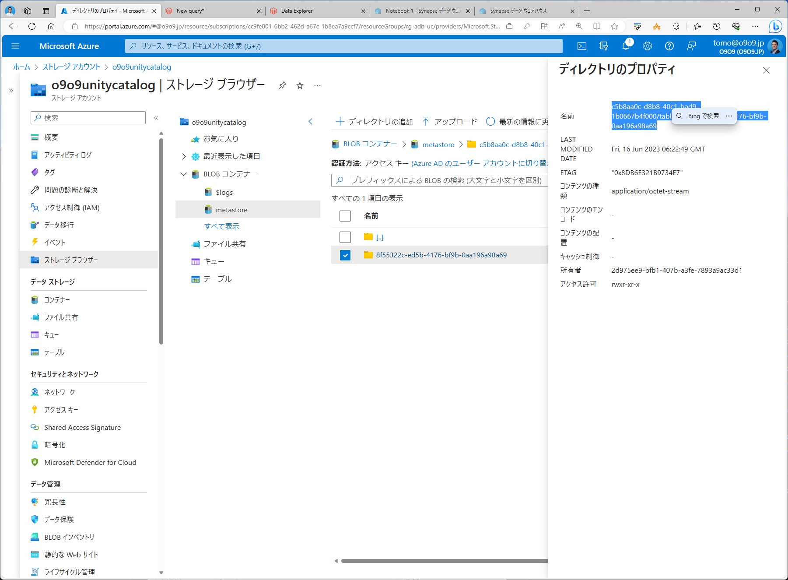
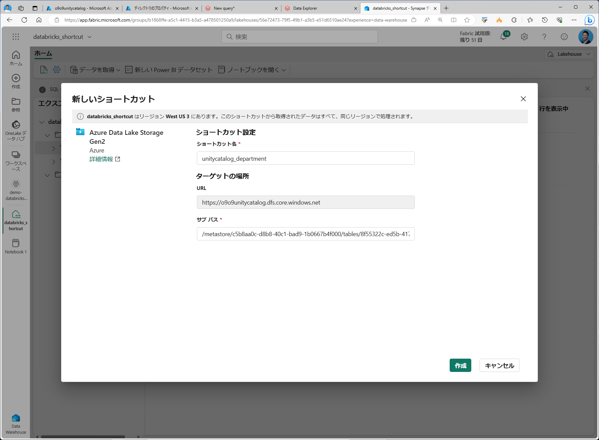
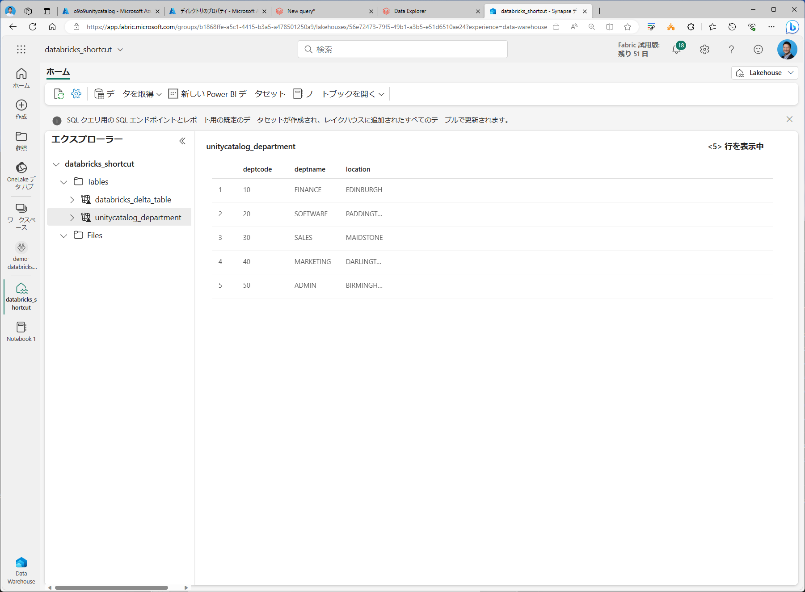
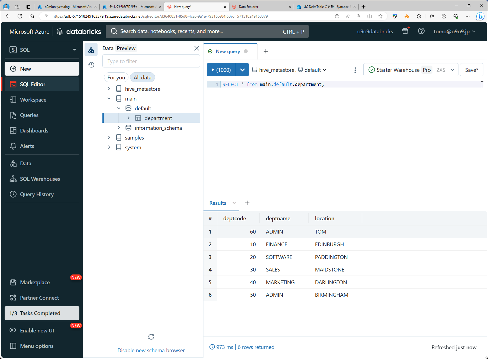

Paste Image を利用。
Ctrl + Alt + v でクリップボードの画像をペースト。
https://raw.githubusercontent.com/gho9o9/imagerepo/main/<カテゴリ>/images/*.png

  

### Databricks Migration
#### まとめ

#### Step by Step 
ADB で DeltaTable を定義

Fabric Lakehouse ショートカットで DeltaLake をアタッチ

Fabric Lakehouse から参照＆更新＆タイムトラベル

ADB と相互運用可能

Lakehouse SQL Endpoint からも参照が可能（更新は不可）

Lakehouse 経由で Warehouse に DeltaTable をコピー

Warehouse 上で Read/Write

Lakehouse SQL Endpoint に Warehouse をアタッチ

Lakehouse SQL Endpoin から Warehouse を更新可能

Lakehouse ショートカットで Warehouse をアタッチ

Spark からの Write は不可

UC で DeltaTable 定義

UCのテーブルはフォルダパスがランダムな文字列になってしまうのでショートカット作成時のパス指定がつらい。

Fabric Lakehouse ショートカットで Datalake 上の DeltaTable をアタッチ

Fabric Lakehouse から UC DeltaTable を更新

