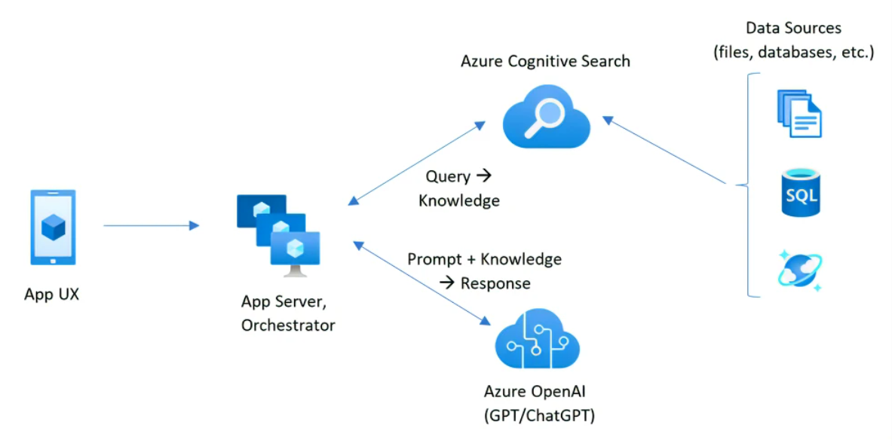
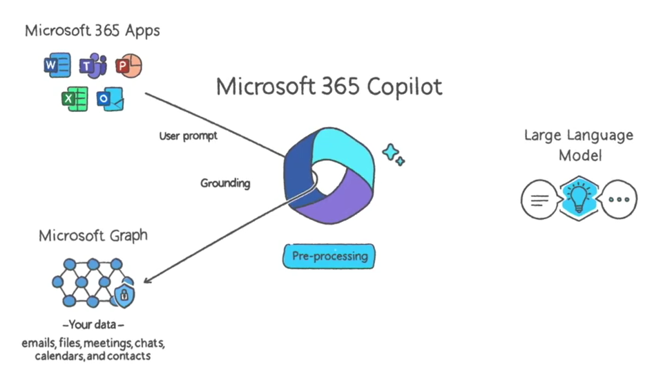
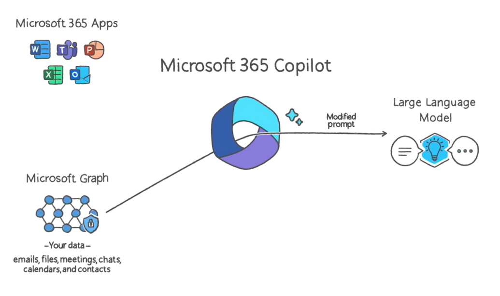

GPT-4 のパラメータは 100兆 以上

### 課題
- トークン長に制限があるため、ヒント（ガードレールや追加コンテキス）はクエリに最も関連性の高い小さい情報をセットしてやることが重要
  - GPT4で改善（GPT3：4,096　->　GPT4：32,768）
### ソリューション
- ヒント濃縮のためにベクトル類似検索やセマンティック検索との組み合わせが現時点のベストプラクティス
  - 埋め込みによるベクトル類似検索
    - [Azure OpenAI Service と Azure Cache for Redis でテキストの埋め込みとセマンティック検索を行う (zenn.dev)](https://zenn.dev/microsoft/articles/22d03aa3b2462c)
  - Cog Search（セマンティック検索使って絞り込み）
    - [Azure で ChatGPT × Cognitive Search を使ったエンタープライズサーチを実現 - Qiita](https://qiita.com/nohanaga/items/803c09b5a3a4e2d1776f)

[Revolutionize your Enterprise Data with ChatGPT: Next-gen Apps w/ Azure OpenAI and Cognitive Search](https://techcommunity.microsoft.com/t5/ai-applied-ai-blog/revolutionize-your-enterprise-data-with-chatgpt-next-gen-apps-w/ba-p/3762087)  
[Azure で ChatGPT × Cognitive Search を使ったエンタープライズサーチを実現 - Qiita](https://qiita.com/nohanaga/items/803c09b5a3a4e2d1776f)  

[The Future of Work With AI - Microsoft March 2023 Event](https://www.youtube.com/watch?v=Bf-dbS9CcRU&t=1229s)

