Paste Image を利用。
Ctrl + Alt + v でクリップボードの画像をペースト。
https://raw.githubusercontent.com/gho9o9/imagerepo/main/<カテゴリ>/images/*.png

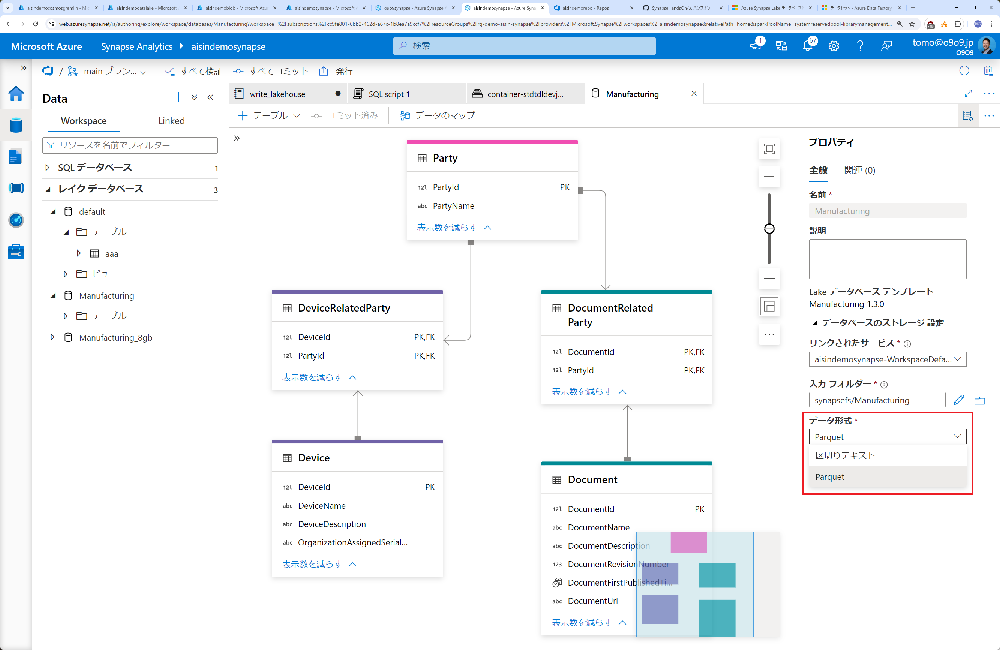

# PBI Mart
## Synapse の場合（接続情報を明示的に指定する）
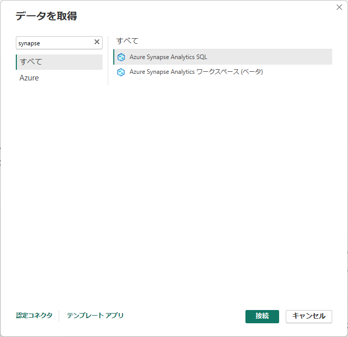
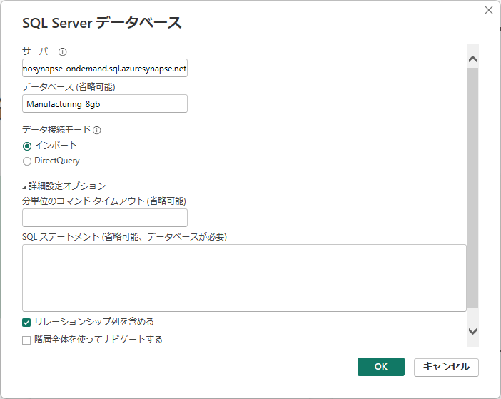  
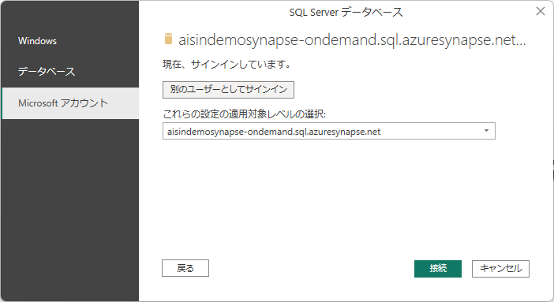  
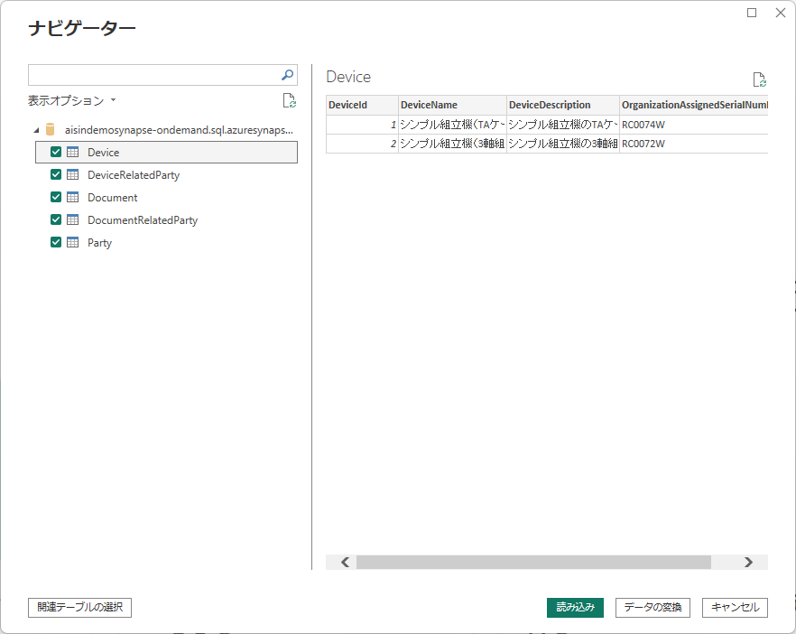  
  
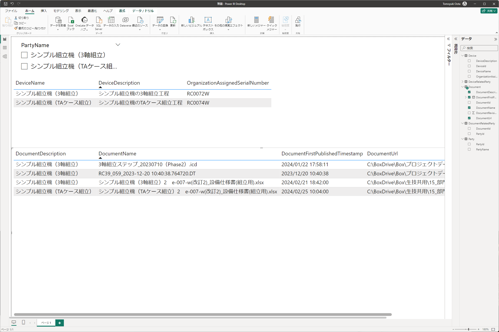  
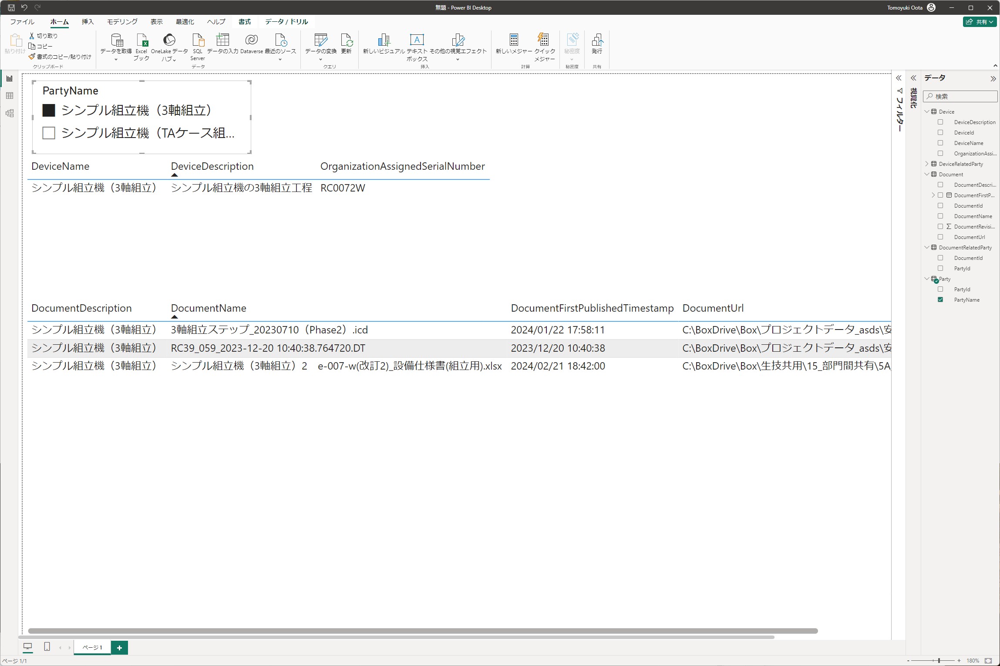  
## Synapse Workspace の場合（テナント配下の Workspace が自動的に一覧される）
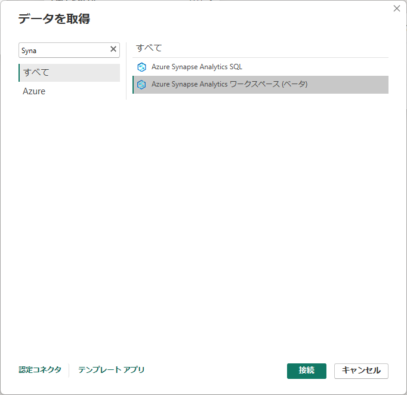  
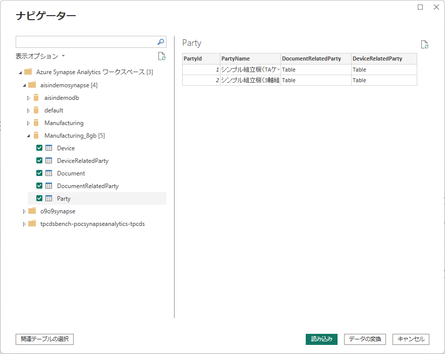  
  
  
  

# PBI Graph(wssでの接続はできずhttpsのみ)
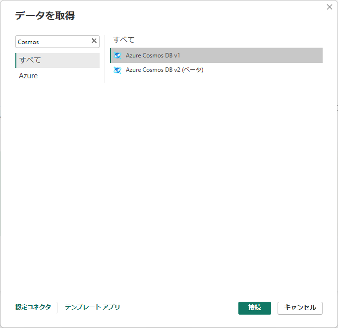  
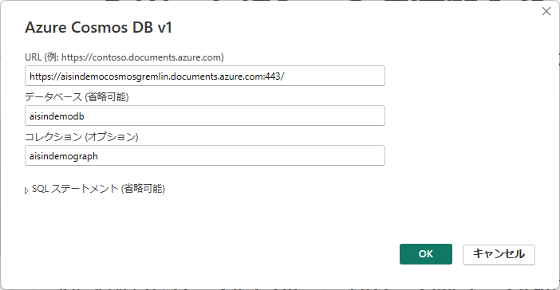  
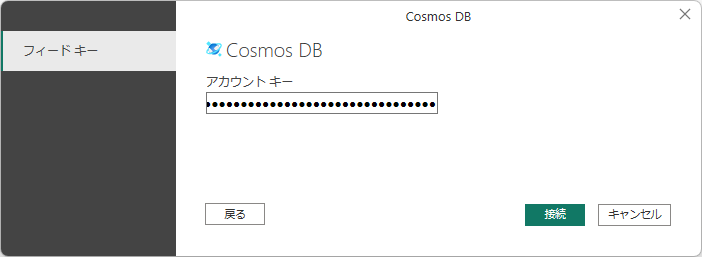  
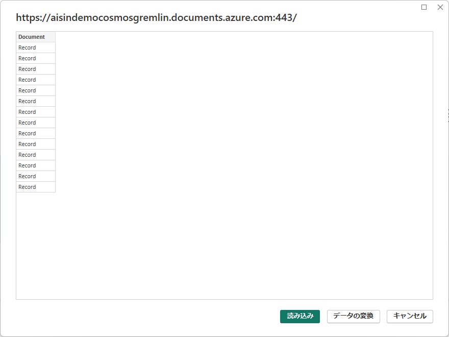  
